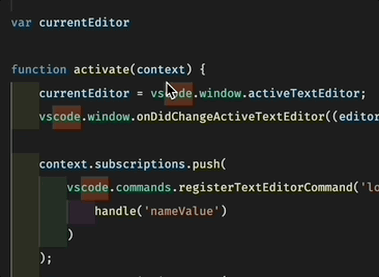
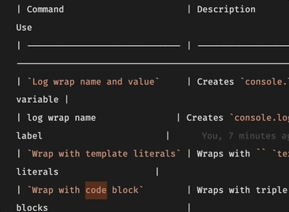
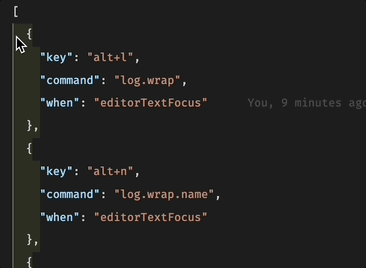

# Wrap Stuff

The `wrap-stuff` extension enhances your development experience by providing convenient wrapping utilities:

- **Console.log Wrap**: Wraps selected code in a `console.log` statement (or `var_dump` in PHP), removing any quotes in the variable name
- **Template Literal Wrap**: Wraps selected text with backticks for template literals
- **Code Block Wrap**: Wraps selected text with markdown code block syntax

When no text is selected, each wrap command creates an empty wrapper with cursor properly positioned inside.

## Demonstrations

### Console.log Wrap



### Template Literal Wrap



### Code Block Wrap



## Commands

The extension provides the following commands (accessible via Command Palette - `Ctrl+Shift+P` or `Cmd+Shift+P`):

| Command                       | Description                                 | When to Use                                                |
| ----------------------------- | ------------------------------------------- | ---------------------------------------------------------- |
| `Log wrap name and value`     | Creates `console.log('variable', variable)` | When you want to log both the name and value of a variable |
| `log wrap name`               | Creates `console.log('variable')`           | When you just want to output a label                       |
| `Wrap with template literals` | Wraps with `` `text` ``                     | For creating JavaScript template literals                  |
| `Wrap with code block`        | Wraps with triple backticks                 | For creating Markdown code blocks                          |

## Keyboard Shortcuts

You can assign keyboard shortcuts to these commands by adding entries to your `keybindings.json`:

```json
[
  {
    "key": "alt+l",
    "command": "log.wrap",
    "when": "editorTextFocus"
  },
  {
    "key": "alt+n",
    "command": "log.wrap.name",
    "when": "editorTextFocus"
  },
  {
    "key": "alt+t",
    "command": "template.literal.wrap",
    "when": "editorTextFocus"
  },
  {
    "key": "alt+c",
    "command": "code.block.wrap",
    "when": "editorTextFocus"
  }
]
```

## Known Issues

Currently, there are no known issues with the `wrap-stuff` extension. If you encounter any problems, please open an issue on the [GitHub repository](https://github.com/ronnyalex/wrap-stuff/issues).

## Release Notes

### 0.0.13

- Fix README.md link

### 0.0.11

- Added feature to create empty template literals when no text is selected
- Added feature to create empty code blocks when no text is selected
- Added feature to create empty console.log statements when no text is selected

### 0.0.10

Initial release of `wrap-stuff`.
